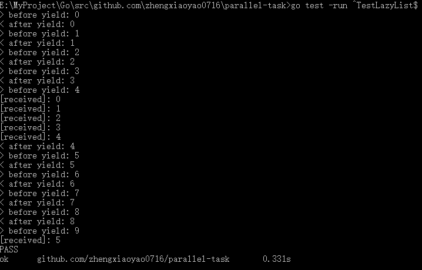
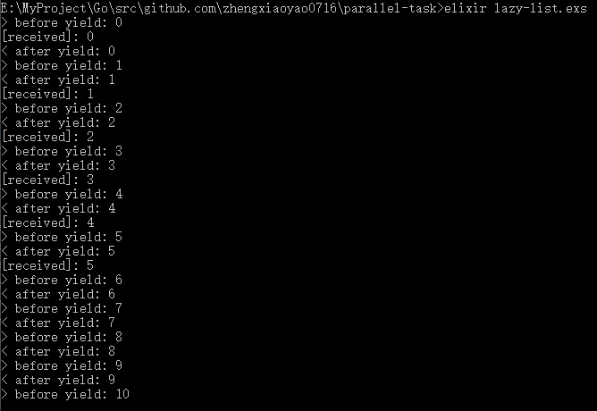
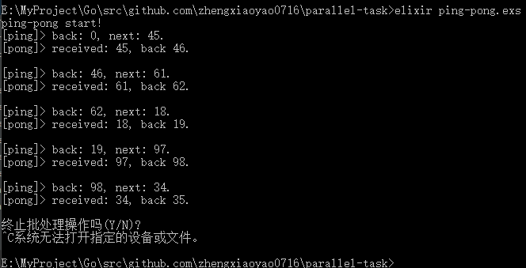
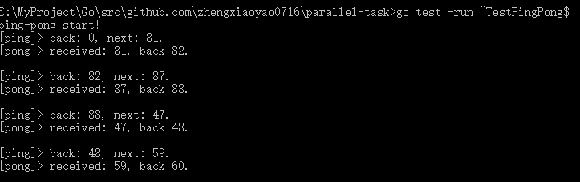

# 小凡计划-并发作业

***
***
## 一、选题
### 1. 原题
#### CSP章节由一个思考题目：
思考：如何实现一个这样的channel，或者叫做Blocking queue，或者叫
Bounded buffer

#### Actor章节由一段提示：
其实这个跟goroutine 这种csp多出来的channel 是等价的，显然可以用每
个goroutine一个channel来模拟actor model，但也可以用actor model来模
拟channel，用一个actor来对应一个channel

想象你去医院，到了分诊阶段，这时候可以认为分诊台背后的5个医务室
把分诊台做为一个channel，去dequeue得到病人，概念上这个分诊台actor
被做为了channel，如何实现呢？

### 2. 分析
结合以上CSP章节的“思考”与Actor章节的提示，我计划用 `Elixir` 模拟 `Go` 的 `channel` ，再用 `Go` 的 `channel` 模拟 `Elixir(Erlang)` 的 `Process` 。


***
***
## 二、Elixir模拟Go
### 1. 代码实现及效果截图
#### Go目标代码：[lazy list](./lazy_list_test.go)
> 展示用Go的channel实现类似yield的特性
``` go
package task_test

import (
	"fmt"
	"testing"
	"time"
)

type LazyList chan int

func NewLazyList(init int, iter func(prev int) int) *LazyList {
	ch := LazyList(make(chan int, 3))
	go ch.Yield(init, iter)
	return &ch
}
func (list *LazyList) Yield(next int, iter func(prev int) int) {
	fmt.Println("> before yield:", next)
	*list <- next
	fmt.Println("< after yield:", next)
	list.Yield(iter(next), iter)
}
func (list *LazyList) Get() int {
	return <-*list
}

func TestLazyList(*testing.T) {
	infiniteList := NewLazyList(0, func(prev int) int { return 1 + prev })
	for i := 0; i < 6; i++ {
		num := infiniteList.Get()
		fmt.Println("[received]:", num)
	}
	time.Sleep(100)
}

```
效果图：
> `go test -run ^TestLazyList$`


#### Elixir模拟：[lazy list](./lazy-list.exs)
> Elixir实现channel语义，然后实现上面的例子
``` elixir
#region Emulate Channel

defmodule Channel do
  defstruct [:in, :out]

  def make(bufsize) do
    {:ok, pid_in} = Task.start_link(fn -> loop_in(bufsize) end)
    {:ok, pid_out} = Task.start_link(fn -> loop_out() end)
    %Channel{in: pid_in, out: pid_out}
  end
  def make(), do: make(0)

  defp loop_in(bufsize) do
    receive do
      {:put, data, pid_out, sender} ->
        send pid_out, {:pipe, data, self(), sender}
        if bufsize >= 0 do
          send sender, {:channel_put_ok}
        end
        loop_in(bufsize - 1)
      {:pipe_ok, sender} ->
        if bufsize < -1 do
          send sender, {:channel_put_ok}
        end
        loop_in(bufsize + 1)
    end
  end
  defp loop_out() do
    receive do
      {:get, receiver} ->
        receive do
          {:pipe, data, pid_in, sender} -> 
            send receiver, {:channel_get_ok, data}
            send pid_in, {:pipe_ok, sender}
            loop_out()
        end
    end
  end

  def put(%Channel{in: pid_in, out: pid_out}, data) do
    send pid_in, {:put, data, pid_out, self()}
    receive do: ({:channel_put_ok} -> nil)
  end
  def get(%Channel{out: pid_out}, action) do
    send pid_out, {:get, self()}
    receive do: ({:channel_get_ok, data} -> action.(data))
  end
end
#endregion

defmodule LazyList do
  defstruct channel: nil

  def new(init, iterator) do
    ch = Channel.make(3)
    {:ok, _} = Task.start_link(fn -> yield(ch, init, iterator) end)
    %LazyList{channel: ch}
  end

  defp yield(ch, next, iterator) do
    IO.puts "> before yield: #{next}"
    Channel.put(ch, next)
    IO.puts "< after yield: #{next}"
    yield(ch, iterator.(next), iterator)
  end
  def get(%LazyList{channel: ch}, action) do
      Channel.get(ch, action)
  end
end

infinite_list = LazyList.new(0, &(1+&1))
0..5 |> Enum.each(fn _ ->
  LazyList.get infinite_list, fn
    num -> IO.puts "[received]: #{num}"
  end
end)
Process.sleep 100 # blocked 100ms to watch the channel buffer.

```
效果图：
> `elixir lazy-list.exs`


***
### 2. 实现原理与结果分析
很显然，用 `Elixir(Erlang)` 的 `Process` 实现类似 `Go` 的 `channel` 语义是没问题的。

分析可知，一个Process的进程邮箱本身就类似一个管道，不同的是其发送默认不会阻塞。所以，这里实现的关键其实在于如何在缓冲区（默认为零）用尽时将下一次发送阻塞直到缓冲区可用。

很容易想到，用自动阻塞的receive语义可以简单的模拟这一效果，那么Elixir的实现方案就出来了：
1. 发送者向进程邮箱发一个写消息来请求将数据置入管道 `(:put)` ，同时立即receive一下某个特定格式的消息 `(:channel_put_ok)` ，以模拟发送时阻塞。
2. 进程邮箱收到写消息后，缓存要写入的数据，根据缓存区空间决定是否立即向发送者发出置入完毕通知 `(:channel_put_ok)` ，以唤醒阻塞中的发送者。
3. 接受者向进程邮箱发一个读消息请求从管道取出数据 `(:get)` ，同时receive一下特定消息 `(:channel_get_ok)` ，管道中的数据将随着这个消息一起返还。
4. 进程邮箱收到读消息后将管道中的数据以特定消息格式发给接受者 `(:channel_get_ok)` ，根据缓存区空间判断发送者是否还在阻塞，决定是否发送置入完毕的通知 `(:channel_put_ok)` 唤醒发送者。

实际实现中，我其实创建了两个进程邮箱 `(:in, :out)` ，一个专门处理管道入口相关消息（发送者置入消息、向发送者通知置入完毕），另一个专门处理管道的出口相关消息（接受者请求消息，向接受者发送管道的数据），两个进程之间通过 `(:pipe, :pipe_ok)` 两个消息进行数据交换。这样做的好处自然是为了实现起来比较简单，省去考虑管道流入与流出数据之间的竞争可能导致的管道阻塞。

就结果而言，用Elixir模拟的管道与Go的channel在功能上基本等价，但从截图可以看出，二者的输出并不一致，这主要是两种语言本身的调度策略与粒度导致的。

在Go中，管道的入口方不断发送直到管道缓冲区充，这时管道写入阻塞，才调度到管道出口一方，然后不断接收直到管道数据用尽，这时读取阻塞再调度回入口一方。

在Elixir中，向进程邮箱发送消息后，receive时，实际就已经发生了阻塞，虽然在缓冲区充足的情况下，管道入口立刻就返回了置入成功，但此时接收方已经得到被调度的机会了。

要解决这个不一致关键应该在于，当管道缓冲区足够时，置入操作直接成功，不阻塞等待入口的置入成功消息，我考虑了很久，貌似没有什么可靠的方案，因为Elixir/Erlang的不可变特性，在不利用进程邮箱的前提下维护一个缓冲队列（或缓冲区计数）是不太现实的。

换个角度理解，在Go中带有buffer的channel，在缓冲未满时，实际上可视为一个具有最大长度只写的同步队列（从入口的角度来看），只是当写入量超过最大长度时不发生越界，而是阻塞罢了。这样的特性，在不可变的Elixir/Erlang里（我认为）确实是无法实现的。但这并不是说Actor模型与CSP模型不能相互实现，只是说明由于语言本身的限制，Elixir/Erlang的进程邮箱并不能完全实现channel的所有特性。


***
***
## 三、Go模拟Elixir
### 1. 代码实现及效果截图
#### Elixir目标代码：[ping pong](./ping-pong.exs)
> 展示用Elixir实现进程间socket通信
``` elixir
defmodule PingPong do
  def play do
    pid_ping = spawn &loop_ping/0
    pid_pong = spawn &loop_pong/0
    IO.puts "ping-pong start!"
    send pid_ping, {0, pid_pong}
  end

  defp loop_ping do
    receive do
      {ball, caller} ->
        Process.sleep 1000
        next = Enum.random(0..99)
        IO.puts "[ping]> back: #{ball}, next: #{next}."
        send caller, {next, self()}
        loop_ping()
    end
  end
  defp loop_pong do
    receive do
      {ball, caller} ->
        back = ball + 1
        IO.puts "[pong]> received: #{ball}, back #{back}."
        IO.puts ""
        send caller, {back, self()}
        loop_pong()
    end
  end
end
PingPong.play()
Process.sleep :infinity

```
效果图：
> `elixir ping-pong.exs`


#### Go用channel模拟：[ping pong](./ping_pong_test.go)
> Go实现Process语义，然后实现上面的例子
``` go
package task_test

import (
	"fmt"
	"math/rand"
	"testing"
	"time"
)

//#region Emulate Process

type Process chan interface{}

func Spawn(recive func(self Process)) *Process {
	self := Process(make(chan interface{}))
	go recive(self)
	return &self
}
func Send(to Process, message interface{}) {
	go func() { to <- message }()
}

//#endregion

func play() {
	ping := Spawn(loop_ping)
	pong := Spawn(loop_pong)
	fmt.Println("ping-pong start!")
	Send(*ping, Message{0, *pong})
}
func loop_ping(self Process) {
	message := (<-self).(Message) // receive
	time.Sleep(1 * time.Second)
	next := rand.Intn(100)
	fmt.Printf("[ping]> back: %d, next: %d.\n", message.ball, next)
	Send(message.caller, Message{next, self})
	loop_ping(self)
}
func loop_pong(self Process) {
	message := (<-self).(Message) // receive
	back := message.ball + 1
	fmt.Printf("[pong]> received: %d, back %d.\n", message.ball, back)
	fmt.Println("")
	Send(message.caller, Message{back, self})
	loop_pong(self)
}

type Message struct {
	ball   int
	caller Process
}

func TestPingPong(t *testing.T) {
	play()
	select {}
}

```
效果图：
> `go test -run ^TestPingPong$`


***
### 2. 实现原理与结果分析
相比起用 `Elixir/Erlang` 的 `Process` 实现 `Go` 的 `channel` 语义，用 `Go` 的 `channel` 与 `goroutine` 实现 `Process` 的语义看起来似乎简直可以说是没难度，用一个管道模拟进程邮箱就好了。

但这也只是表象，需要注意，在 `Elixir` 中发送消息是非阻塞的，而 `channel` 的发送默认是阻塞的。在 `Go` 中，要使管道的发送非阻塞，需要给管道设置缓冲区，但这个缓冲区总会有容量上限，总会撑满，这时候发送消息就会阻塞了。

在这个意义上，进程邮箱可以看作是一个无限大的缓冲区，而这用管道中是实现不了的。这里采用的方案，是直接创建一个 `goroutine` 来发送消息，来避免管道缓冲满了时阻塞发送者。换而言之，把原来应该由进程邮箱（管道）维护的缓冲区，交给了协程调度去维护。这么做的好处是容易实现，如你所见的，实现一个这样的 `Actor` 模型只需要10行代码。但坏处也很明显，消息堆积时会产生大量的阻塞的协程。

要解决这个问题，我的一个思路是，首先，所有通过管道的数据在出口端立即收集到一个可变长队列里，保证管道中不会堆积消息，然后再用另一个管道，作为进程邮箱接收消息的出口，一端连着这个缓冲队列，另一端连着接受者。如此只需要多建立一个协程维护缓冲队列就可以了，避免了大量阻塞的协程堆积。

这样一来，问题就变成了怎样从缓冲队列里把消息自动冲入到出口管道了。写个死循环不断判断队列是否为空然后不断把队列中的值取出发往出口管道貌似可行，但考虑到一直没消息时的循环空转，虽然在 `goroutine` 架构下不至于占满CPU，也是不太合适的。

对于这个新问题，我暂时的想法时再来一个辅助管道，当接受者请求数据前先通过辅助管道发出一个消息，维护缓冲队列的协程里，添加select结构，循环监听辅助管道或入口管道的消息，入口管道消息来了就进缓冲队列，辅助管道消息来了，根据队列是否有缓存，决定直接向出口管道发数据，还是等待下次的循环监听到的入口管道消息再发往出口管道。

结论，虽然用 `channel` 实现一个功能类似 `Elixir/Erlang` 的 `Process` 的模型很容易，但要做到完全一致的底层原理，保证在极端情况下的可用与稳定还是有些麻烦的，反正我是懒的弄了。虽然现在看起来 `Go` 的这个版本比目标代码也不算复杂太多，但估计要完全展开的话可能不比第一例里 `Elixir` 实现的 `LasyList` 代码好看到哪儿去。就像第一例里，其实如果 `Elixir` 版本不考虑缓冲区与发送者的阻塞问题，也可以很简单。


***
***
## 四、实验总结
CSP有CSP的编程模型，Actor有Actor的，二者理论上是等价可互换的，用不同的方法都能解决同样的问题，而且都很优雅（从两例里目标代码总比模拟代码精简易读就能看出），但非要模拟对方的方法，用对方的思路来解决问题就很别扭了。
